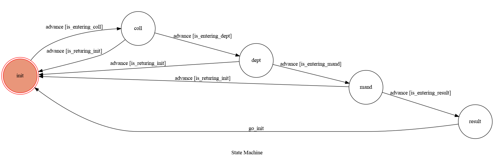


# TOC Project 2020

[](https://codeclimate.com/github/NCKU-CCS/TOC-Project-2020/maintainability)

[](https://snyk.io/test/github/NCKU-CCS/TOC-Project-2020)

Chatbot showing the courses that matches the department and the mandatoriness the user specifies in the current semester in NCKU.

A Line bot based on a finite state machine

More details in the [Slides](https://hackmd.io/@TTW/ToC-2019-Project#) and [FAQ](https://hackmd.io/s/B1Xw7E8kN)

## How It Works

Instead of integrating the web scraping code in this repository and scrape the [NCKU course website](https://course.ncku.edu.tw/) on demand, I put it in this [separate repository](https://gitlab.com/ethan0150/toc-linebot-crawler) and set Gitlab CI/CD to run it periodically (hourly). Each time the scheduled CI/CD job is done, the data scraped from the course website is stored as a SQLite file and published in the form of job artifacts, which kinda treats Gitlab CI/CD as a free file server. The linebot downloads the latest SQLite file and operates on it. There are several benefits dividing the project in this way:

 - The SQLite file is like a cache, making performance much better than scraping data off the website on user's demand.
 - Easier to debug.
 - Avoids the bot's IP being banned by the course website, since the website is only bothered once an hour.
## Setup

### Prerequisite
* Python 3.7
* Pipenv

#### Install Dependency
```sh
pip3 install pipenv

pipenv --three

pipenv install

pipenv shell
```

* pygraphviz (For visualizing Finite State Machine)
    * [Setup pygraphviz on Ubuntu](http://www.jianshu.com/p/a3da7ecc5303)
	* [Note: macOS Install error](https://github.com/pygraphviz/pygraphviz/issues/100)


#### Secret Data
You should generate a `.env` file to set Environment Variables refer to our `.env.sample`.
`LINE_CHANNEL_SECRET` and `LINE_CHANNEL_ACCESS_TOKEN` **MUST** be set to proper values.
Otherwise, you might not be able to run your code.

#### Run Locally
You can either setup https server or using `ngrok` as a proxy.

#### a. Ngrok installation
* [ macOS, Windows, Linux](https://ngrok.com/download)

or you can use Homebrew (MAC)
```sh
brew cask install ngrok
```

**`ngrok` would be used in the following instruction**

```sh
ngrok http 8000
```

After that, `ngrok` would generate a https URL.

#### Run the sever

```sh
python3 app.py
```

#### b. Servo

Or You can use [servo](http://serveo.net/) to expose local servers to the internet.


## Finite State Machine


## Usage
- `init` : Initial state. Jumps to coll after the user enters "query"
- `coll` : Lets the user choose departments of which college to display.
- `dept` : Lets the user choose a department of the college chosen in `coll` state.
- `mand`: Lets the user choose the mandatoriness of the courses
- `result`: Displays the querying result. Jumps back to `init` unconditionally after the querying result has been displayed.

Users can also enter "exit" at `coll`, `dept` or `mand` to go back to `init`.
## Deploy
Setting to deploy webhooks on Heroku.

### Heroku CLI installation

* [macOS, Windows](https://devcenter.heroku.com/articles/heroku-cli)

or you can use Homebrew (MAC)
```sh
brew tap heroku/brew && brew install heroku
```

or you can use Snap (Ubuntu 16+)
```sh
sudo snap install --classic heroku
```

### Connect to Heroku

1. Register Heroku: https://signup.heroku.com

2. Create Heroku project from website

3. CLI Login

	`heroku login`

### Upload project to Heroku

1. Add local project to Heroku project

	heroku git:remote -a {HEROKU_APP_NAME}

2. Upload project

	```
	git add .
	git commit -m "Add code"
	git push -f heroku master
	```

3. Set Environment - Line Messaging API Secret Keys

	```
	heroku config:set LINE_CHANNEL_SECRET=your_line_channel_secret
	heroku config:set LINE_CHANNEL_ACCESS_TOKEN=your_line_channel_access_token
	```

4. Your Project is now running on Heroku!

	url: `{HEROKU_APP_NAME}.herokuapp.com/callback`

	debug command: `heroku logs --tail --app {HEROKU_APP_NAME}`

5. If fail with `pygraphviz` install errors

	run commands below can solve the problems
	```
	heroku buildpacks:set heroku/python
	heroku buildpacks:add --index 1 heroku-community/apt
	```

	refference: https://hackmd.io/@ccw/B1Xw7E8kN?type=view#Q2-如何在-Heroku-使用-pygraphviz

## Reference
[Pipenv](https://medium.com/@chihsuan/pipenv-更簡單-更快速的-python-套件管理工具-135a47e504f4) ❤️ [@chihsuan](https://github.com/chihsuan)

[TOC-Project-2019](https://github.com/winonecheng/TOC-Project-2019) ❤️ [@winonecheng](https://github.com/winonecheng)

Flask Architecture ❤️ [@Sirius207](https://github.com/Sirius207)

[Line line-bot-sdk-python](https://github.com/line/line-bot-sdk-python/tree/master/examples/flask-echo)
